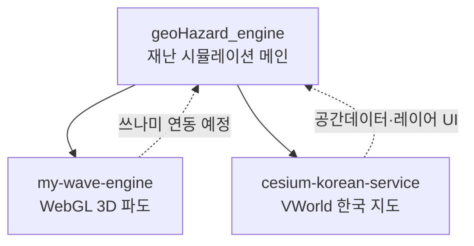

# JSeungHO

**3D 지리 · WebGL · 재난 시뮬레이션**

CesiumJS 위에 재난 시뮬레이션, 파도 엔진, 한국 공간데이터를 올리는 프로젝트를 만들고 있습니다.

---

## About

| | |
|---|---|
| **관심 분야** | CesiumJS · WebGL/GLSL · 재난 시뮬레이션 · 디지털 트윈 |
| **주요 스택** | JavaScript · React · Vite · Cesium Ion · VWorld API · .NET |
| **현재 작업** | `geoHazard_engine` 재난 모듈 확장 · `my-wave-engine` 쓰나미 연동 |

---

## Featured Projects

### geoHazard_engine
> 홍수 · 지진 · 쓰나미를 **3D 지구본 위에서** 시각화하는 모듈형 재난 시뮬레이션

`React` `CesiumJS` `Vite` `Vitest` `Playwright`

---

### cesium-korean-service
> **VWorld WMTS** 배경지도 + Cesium World Terrain 한국 3D 지도 서비스

`CesiumJS` `VWorld API` `Vite` `Vercel`

---

### my-wave-engine
> **Gerstner wave** WebGL 파도 엔진 · Cesium adapter · .NET CLI 자동화

`WebGL` `GLSL` `CesiumJS` `C#` `Vite`

---

### grid-city
> Vite 기반 그리드 도시 시각화 실험

`Vite` `JavaScript` `WebGL`

---

## Architecture

---

## GitHub Stats

---

**Portfolio entry point:** [geoHazard_engine](https://github.com/JSeungHO/geoHazard_engine) → [cesium-korean-service](https://github.com/JSeungHO/cesium-korean-service) → [my-wave-engine](https://github.com/JSeungHO/my-wave-engine)

